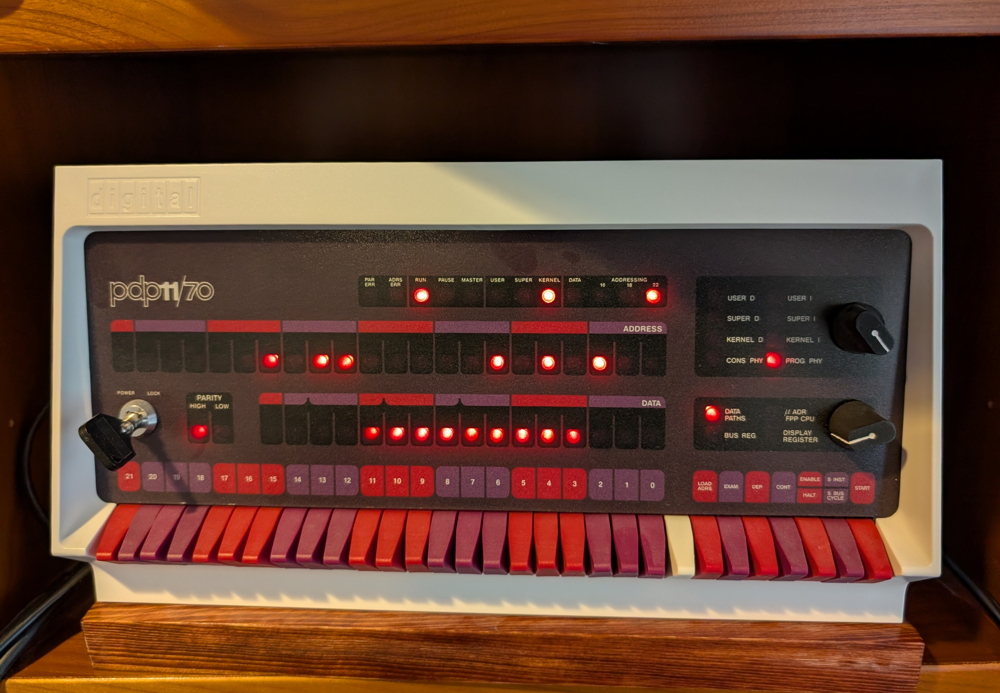

Knobs 1-3 are from some of the folks on the PiDP-11 forum.

I made a few changes, which are in knob4.scad.  That is the one I printed.  I
tried it two ways, one printed in black, and sprayed with flat black paint.
The white line was done with nail polish very carefully.

I also tried printing in white, and brushing on Floquil engine black.  The
white is not very vibrant on that one, so I used the ones with the nail polish
on the PiDP-11.

This is an open-source project.  This work is licensed under CC BY-SA 4.0:

https://creativecommons.org/licenses/by/4.0/ 

Here is what the knobs look like on a PiDP-11:

